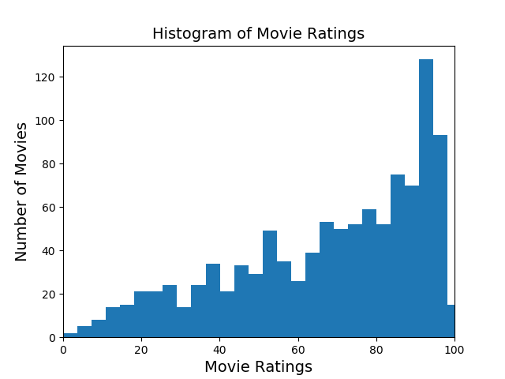
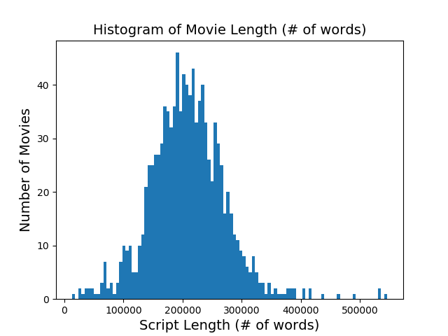
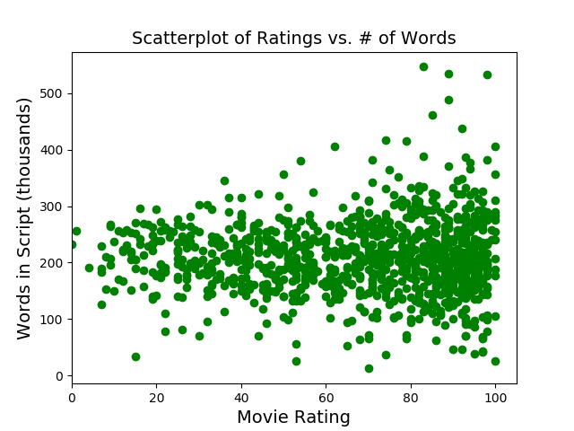
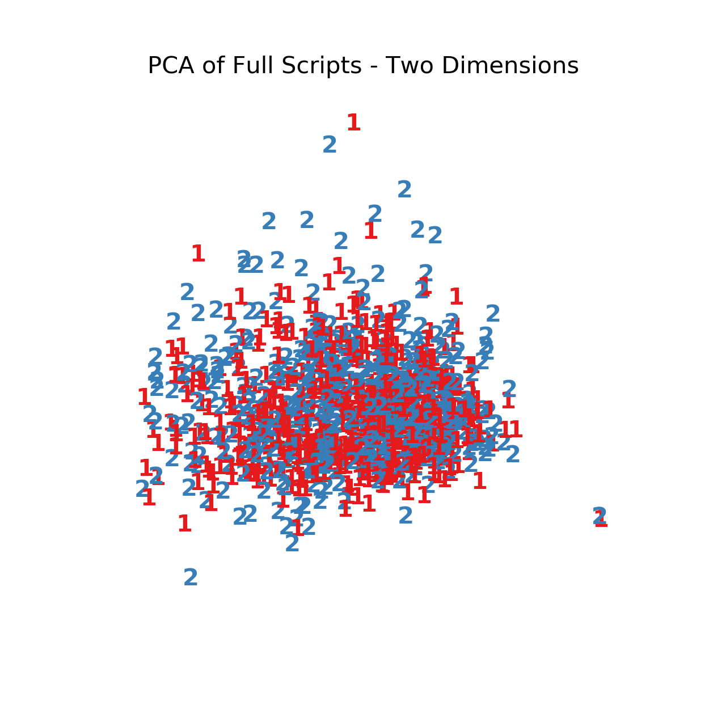
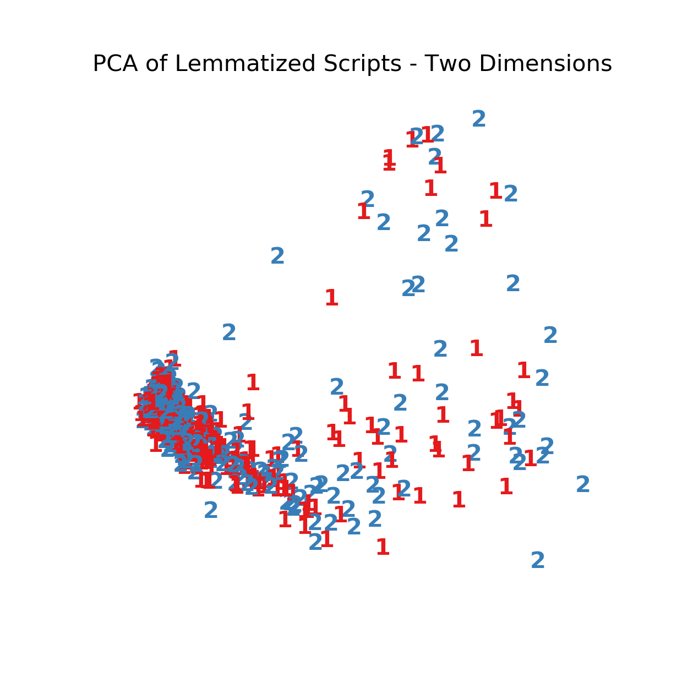
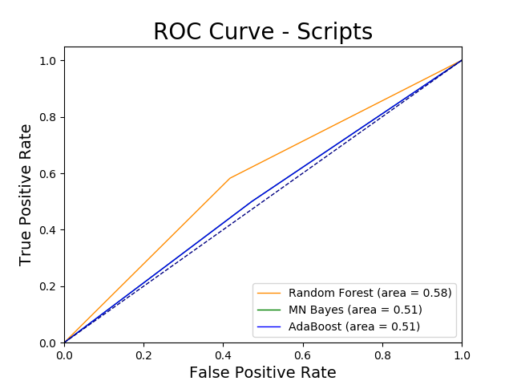
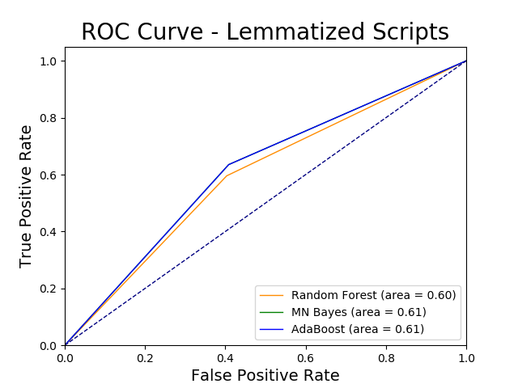
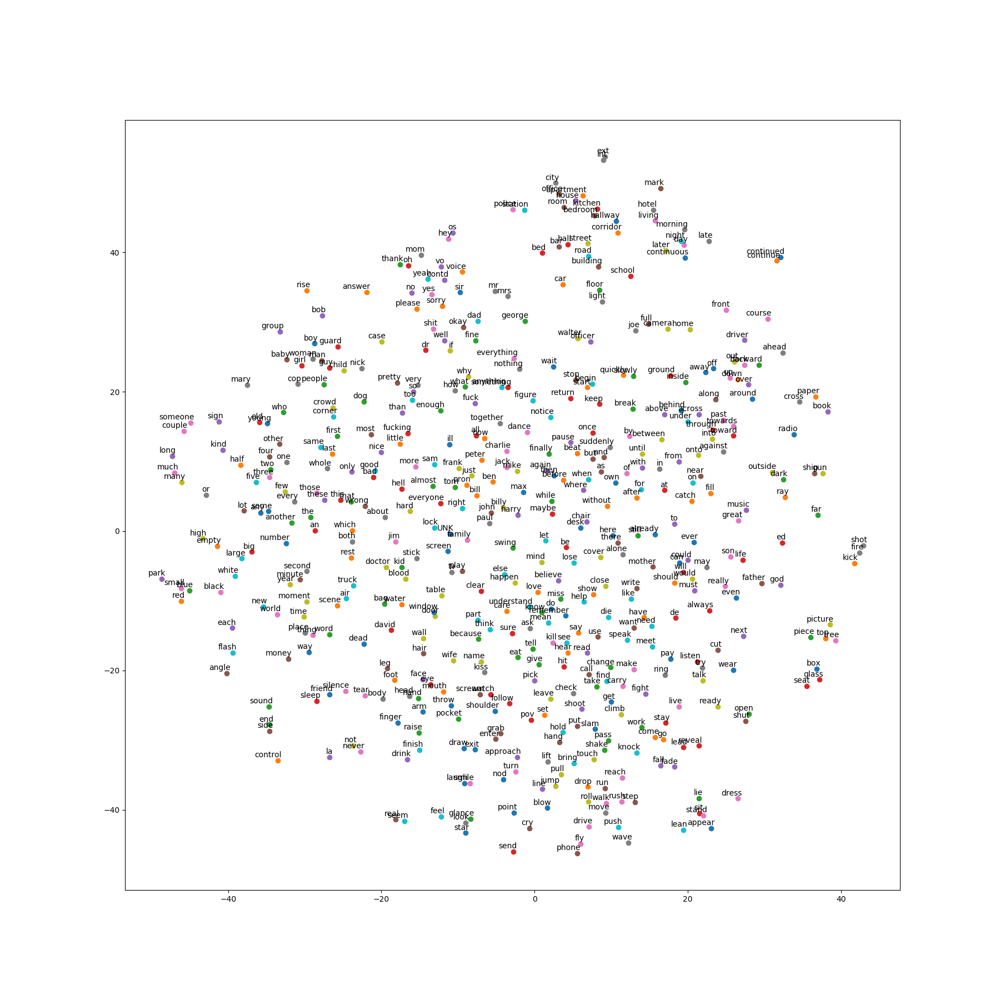

# Using NLP to Analyze Movie Scripts

### Data
 - Approximately 1,000 movie raw movie scripts, with associated rotten tomato scores.


 | Movie Title        | Plot Summary          | RT%  |
 | ------------- |-------------| -----|
 | The Wolf of Wall Street     | 'string of movie script' | 78.0 |

### Goals
- Conduct EDA to understand what data is provided.
- Lemmatize scripts for potential easier analysis.
- Create tf-idf of lemmatized text and movie scripts.
- Reduce dimensions of data to extract patterns.
- Run a model to predict if a movie will have a 'Good' score or a 'Bad' score, according to Rotten Tomatoes.
-

### Exploratory Data Analysis







### Lemmatize Movie Scripts

For easier text analysis, we lowercase all words, strip all punctuation and unicode from plot summaries, remove all stop words, then use spaCy to lemmatize words to tokens.

Before  | After
------------- | -------------
'Jordan Belfort is a Long Island penny stockbroker who served 22 months in prison for defrauding investors in a massive 1990s securities scam that involved widespread corruption on Wall Street and in the corporate banking world, including shoe designer Steve Madden.'  | 'jordan belfort long island penny stockbroker serve 22 month prison defraud investor massive 1990s security scam involve widespread corruption wall street corporate banking world include shoe designer steve madden'

### TF-IDF

Creating a term-frequency inverse-document-frequency (tf-idf) table, we can represent a movie as a vector, and compare movies.

title  | token 0  | token 1  | token 2
-------- | ----| ----| -----
movie 1  | 0.0 | 0.4 | 0.1
movie 2  | 0.5 | 0.0 | 0.04

### Dimensionality Reduction

Using Principal Component Analysis, we can reduce the dimensions of the data and remove co-linearity between features.  By reducing the dimensions of the tf-idf to only two dimensions, it is easy to visualize our data. If our data clusters to different areas, it will be easier to find signal, and if our data all clusters to the same area, it will be difficult to extract a signal.





### Modeling

**Naive Bayes**

For every document, calculate the probability that the document belongs to each class ('Good' movie or 'Bad' movie) and chose the class with the highest probability.

To do this, we calculate two things:
- Priors: The probability that a generic document belongs to each class: P(c)
- Conditional Probabilities: The probability that each word appears in each
class: P(x|c)

Naive Bayes is good with text data (tf-idfs), because it is computationally efficient, and simply relies on counting.

Naive Bayes model to find the probability a movie is 'good' (greater than 75% on RT), or 'bad' (less than or equal to 75% on RT).

**Random Forest Classifier**

Built from ensemble of Decision Trees on the basis of bootstrapped samples.  Splits of the Random Forest are made on a random selection of the features, created un-correlated trees to aggregate, creating a more generalized model.

**AdaBoost Classifier**

Both bagging and random forests attempt to take many low-bias, high-variance fully-grown decision trees, and aggregate them together to reduce prediction variance while maintaining low prediction bias.

In Boosting, we start with a high-bias, low-variance decision stump (decision tree with only a couple splits), and arrange many in a series, passing the residuals of the first model as the target of the next model, and iteratively chip away at the bias while maintaining low-variance.

**Modeling with (almost) full script tf-idf vs. lemmatized script tf-idf**





We can see increased accuracy with the models that are run on the lemmatized movie scripts rather than the whole movie scripts.  By taking out commonly used words that often have little meaning (stop words), the models can train on words within the documents that have higher significance.

### Natural Language Processing

Natural language processing (NLP) is an area of computer science and artificial intelligence concerned with the interactions between computers and human languages. In particular: how to program computers to fruitfully process large amounts of natural language data? - Wikipedia 

### Tensorflow - word2vec

**Semantics** - branch of linguistics and logic concerned with meaning.

**Distributional Hypothesis** - words that appear in the same contexts share semantic meaning.

**Word embedding** - words or phrases from a vocabulary are mapped to vectors of real numbers. Capable of capturing context of a word in a document in relation to other words in the document.

**Word2vec** - predictive model for learning word embeddings from raw text.

- Continuous Bag-of-Words (CBOW) model: predicts target words (e.g. 'mat') from source context words ('the cat sits on the').
- Skip-gram model: predicts source context-words from the target words.

Skip-gram model tends to work better on large text documents.  Let's take a look at a 'vanilla' skip-gram model.

Consider the following text:
```python
The quick brown fox jumped over the lazy dog
```
Form a dataset of words, and the context in which they appear (words to the left and to the right of the target; window size = 1)
```python
([the, brown], quick), ([quick, fox], brown), ([brown, jumped], fox), ...

(context, target)
```
Skip-gram tries to predict each context word from from its target word
```python
(quick, the), (quick, brown), (brown, quick), (brown, fox), ...

(input, output)
```

When the model is making the comparisons of targets and context, the targets (words) have different weights and biases associated with them that are updated (as the model makes more comparisons).  This moves the word embedding vectors around.

### Visualizing Word Embeddings

After training on the 1,000 movie scripts, lets take a look at the top 500 words with the most similar word embedding vectors.


